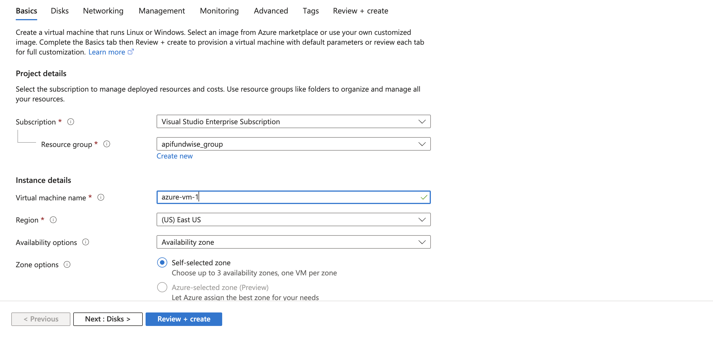

# ☁️ Deploy a Python App on Azure VM Using VS Code (Beginner Friendly Guide)

> In this guide, you'll learn how to:  
> ✅ Create an Azure Ubuntu VM  
> ✅ Connect it to your local VS Code via Remote SSH  
> ✅ Run a simple app or server (like Python's built-in web server)  
> ✅ Make it publicly accessible through your VM's IP address

---

## 🛠️ Step 1: Create a Virtual Machine (VM) on Azure

1. Go to [Azure Portal](https://portal.azure.com)
2. Search **Virtual Machines**, then click **Create**


3. Fill in the required details:
   - **VM name**: Choose any
   - **Region & Zone**: As per your preference
   - **Image**: Ubuntu 22.04 LTS
   - **Size**: B1s or higher



4. Under **Authentication**:
   - Choose **Password** (easy to use)
   - Set a **Username** and **Password** — **save these for later**


5. Click **Review + Create** → then **Create**


---

## 🖥️ Step 2: Connect to the VM with VS Code

### 🔌 Prerequisites

- Install [Visual Studio Code](https://code.visualstudio.com/)
- Install these extensions:
  - ✅ Remote - SSH
  - ✅ Python


### 🔁 Connect Using Remote SSH

1. Press `Cmd + Shift + P` (or `Ctrl + Shift + P` on Windows)
2. Type `Remote-SSH: Add New SSH Host`
3. Enter:
   ```bash
   azure-admin@<your-vm-public-ip>
   ```
4. Enter the password (set during VM creation)


### ✅ Confirm You're Connected

Check the following:

1. The **terminal prompt** should show the VM's username and hostname  
2. In the **bottom-left of VS Code**, you'll see your VM's public IP  


---

## 📂 Step 3: Access Files & Set Up Project

1. In VS Code, click **"Open Folder"**
2. Select any directory (e.g., `/home/azure-admin`) and click **OK**
3. You now have **read & write access** to your VM files


### Create a project folder:

```bash
mkdir fastapi_vm_demo
cd fastapi_vm_demo
```


---

## 🐍 Step 4: Install Python and Dependencies

```bash
sudo apt update
sudo apt install python3 -y
sudo apt install python3-pip python3-venv -y
```

---

## ⚙️ Step 5: Create a `start_service.sh` Script

```bash
nano start_service.sh
```

### Paste this script:

```bash
#!/bin/bash
set -e

cd "$(dirname "$0")"
echo "Working directory: $(pwd)"

python_version=$(python3 --version)
echo "Using $python_version"

if [ ! -d "venv" ]; then
   echo "Creating virtual environment..."
   python3 -m venv venv
fi

echo "Activating virtual environment..."
source venv/bin/activate

which python
which pip

echo "Installing dependencies..."
pip install --verbose -r requirements.txt

echo "Checking if FastAPI is installed..."
python -c "import fastapi; print(f'FastAPI version: {fastapi.__version__}')"

if [ ! -d "templates" ]; then
   echo "WARNING: templates directory not found, creating it..."
   mkdir -p templates
fi

if [ ! -d "static" ]; then
   echo "WARNING: static directory not found, creating it..."
   mkdir -p static
fi

echo "Starting FastAPI application..."
echo "Access at: http://$(hostname -I | awk '{print $1}'):8000"
python -m uvicorn main:app --host 0.0.0.0 --port 8000
```

```bash
chmod +x start_service.sh
```

---

## ▶️ Step 6: Run the Project

```bash
sudo bash /home/azure-admin/fastapi_vm_demo/start_service.sh
```

Check for running service:

```bash
lsof -i :8000
```

Stop process:

```bash
kill -9 <PID>
```

---

## 🌐 Step 7: Expose the App Publicly

Azure → VM → Networking → Add Inbound Port Rule


| Field                  | Value       |
|------------------------|-------------|
| Source                 | Any         |
| Source Port Range      | *           |
| Destination            | Any         |
| Destination Port Range | `8000`      |
| Protocol               | TCP         |
| Action                 | Allow       |
| Priority               | 310         |
| Name                   | allow-8000  |

---

## 🌍 Step 8: Access the App

Open in browser:  
```
http://<your-vm-public-ip>:8000
```


---

## 🛠 Common Errors & Fixes

### ❌ Could not establish connection to `<your-ip>`: The operation timed out

**Fix:**
- Make sure your VM is in a **Started** state from Azure Portal
- Ensure **SSH (port 22)** is open in inbound rules
- Try using a different internet connection if blocked

### ❌ Cannot access app on port 8000

**Fix:**
- Ensure app is running on `0.0.0.0:8000`
- Confirm port 8000 is opened in Azure inbound rules

---

## ✅ You're All Set!

You've now:
- ✅ Created an Azure VM  
- ✅ Connected via VS Code Remote SSH  
- ✅ Ran a Python/FastAPI app  
- ✅ Exposed it via public IP

Happy coding! 🚀